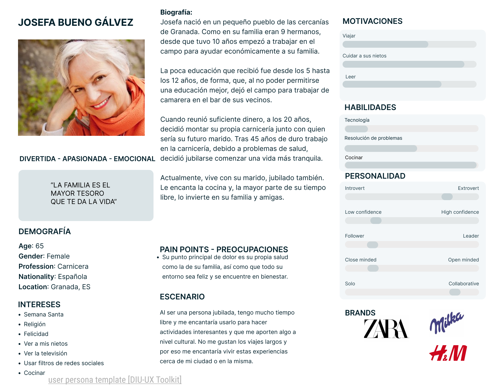
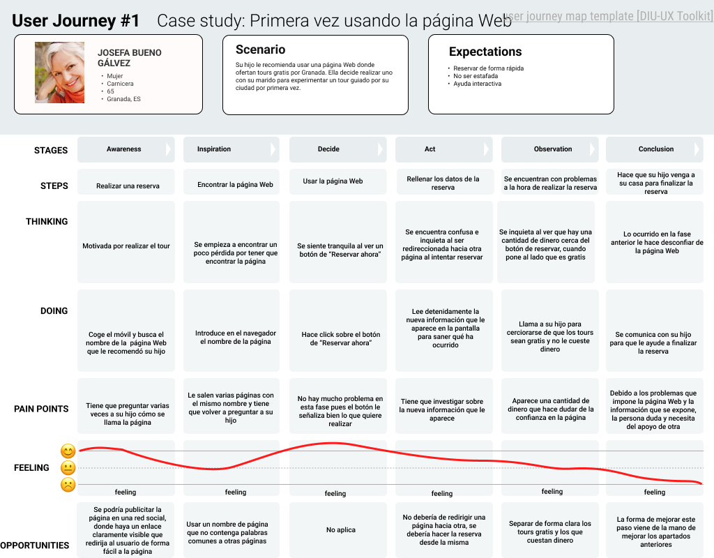

# DIU - Practica1, entregables

En esta primera práctica, hemos realizado el análisis de usabilidad sobre la página web [FreeTour](https://freetour-granada.com/).
Los resultados de dicho análisis y, las conclusiones obtenidas, se han detallado en los apartados inferiores.

## Empathy Maps
Hemos realizado dos empathy maps, uno con nuestra experiencia y otro con la experiencia de nuestras
personas, que representan a los colectivos principales que utilizarán la página web.

### Nuestra experiencia

### Experiencia de nuestras personas

## Competitor Analysis
Hemos realizado una comparación de FreeTour con la competencia, lo que nos ha permitido posicionarlo
como una TERRIBLE opción para cualquier persona que quiera hacer un Tour.

## Personas
Hemos creado dos personas que representan a dos grandes colectivos de usuarios, los adultos y ancianos, además de que hemos considerado
la accesibilidad de los recursos para personas con algún tipo de problema / discapacidad.

### Josefina
Josefina es una persona mayor, residente en Granada, que está jubilada y, ahora que tiene más tiempo libre, quiere disfrutar una experiencia nueva. Por ese motivo, ha decicido reservar para participar en un tour, ya que ella siempre ha estado interesada en este tipo de actividades.

### Manuel
Manuel es una persona que no vive en Granada, sino en Tarragona, Çataluña. Quiere sorprender a su familia con un pequeño viaje para conocer un lugar turístico, por lo que está intentando reservar un tour a través de Internet. Sin embargo, debido a la discapacidad motora de Manuel, es muy importante conocer de antemano si podrá realizar el tour.

## Journey Maps
### Josefina

Como conclusión del Journey Map de Josefina, podemos observar que las redirecciones a otras páginas durante el proceso de
reserva, han provocado que Josefina se sienta confundida e insegura. A esto, se le suma el fallo de diseño que se produce
durante la selección de los tours, ya que, se muestra un precio en el tour pero pone que es gratis, lo que confunde aún más a Josefina.

Debido a esto, ha necesitado la ayuda de su hijo para poder completar la reserva, ya que se sentía muy perdida.

### Manuel

## Usabilidad
En al análisis de usabilidad hemos podido comprobar que la página web falla en los aspectos clave relacionados con el proceso de reserva, algo
que perjudica en gran medida la experiencia del usuario final.

Los principales factores negativos son:
- El rendimiento de la página es horrible
- Las múltiples redirecciones durante el proceso de reserva hacen que te pierdas
- No hay información detallada sobre los tours
- En dispositivos móviles la página web tiene problemas

Todo esto ha resultado en una valoración de 46, que implica que la mayor parte de usuarios tendrán una experiencia negativa en esta página.

## Conclusiones
Nuestra conclusión es que la página web presenta muchas deficiencias de fácil resolución, que impiden una buena experiencia por parte del usuario final.

Como hemos mencionado anteriormente, se debería evitar la redirección a múltiples páginas cuando una persona quiera reservar un tour, ya que eso provoca confusión e incluso inseguridad, debido a los cambios de estilo, tipografía, etc.

La adaptación a dispositivos móviles, fundamental hoy en día, ya que la mayoría de usuarios que encuentren la página por primera vez estarán utilizando un dispositivo móvil, deja mucho que desear en su estado actual, ya que encontramos solapamiento de botones, mala visibilidad, etc.

Por lo tanto, consideramos que hay fallos muy básicos, que provocarán que los usuarios se decanten por los competidores que sí han cuidado la experiencia global.

