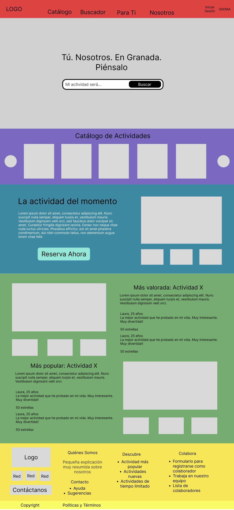
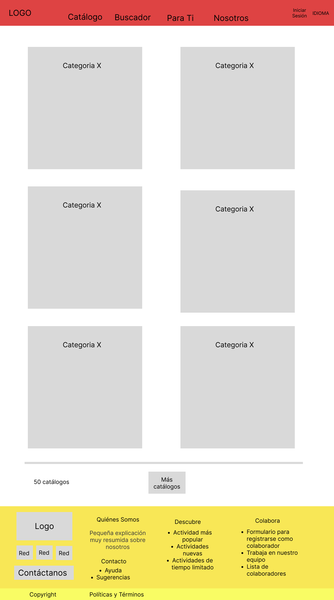

# DIU - Practica 2 - Entregables

## Idea
Nuestra idea se basa en la creación de una aplicación donde no sólo se puedan realizar tours, sino que se puedan realizar todo tipo de actividades 
por Granada. Así, surge nuestra propuesta, **Conecta Granada**.

### Malla receptora de información
Para poder plantear nuestro proyecto, en primer lugar, hemos realizado una malla receptora de información, mediante la cual, hemos observado cuatro aspectos:
  - Like: En este apartado recabamos todas la ideas e implementaciones utilizadas por la competencia que más nos han gustado y que creemos que deben estar presente en
  nuestro proyecto.
  - Wishes: En este apartartado hemos incluido todas las críticas que tenemos sobre la competencia, y que creemos que pueden mejorarse / solucionarse.
  - Questions: Este apartado representa las preguntas que nuestras personas ficticias se han realizado durante su experiencia en la competencia.
  - Ideas: Teniendo en cuenta lo anterior, en este apartado hemos incluido ideas que podemos implementar para mejorar el sitio.

### Propuesta de valor
Nuestra propuesta se trata de una aplicación sencilla, que agrupa todo tipo de actividades culturales en Granada. De esta forma, tanto el proceso de búsqueda
como de reserva estarán simplificados, ya que el usuario no tendrá que recurrir a agencias o buscar en miles de páginas.
Por otro lado, creemos que la capacidad de interacción entre los usuarios es fundamental, por lo que dentro de la propia aplicación podrás compartir tanto las actividades que más te gusten como fotos y vídeos tuyos realizándolas.
También, la facilidad para encontrar actividades afines a nuestros gustos es una tarea pendiente en nuestros competidores, que nosotros, resolveremos mediante un sistema de recomendación personalizado (a partir de un algoritmo).

Escuchando a nuestros usuarios (Manuel y Josefina), hemos visto que los dos principales problemas son:
- Falta de información acerca de los tours
- Dificultad en el proceso de reserva

Estos problemas los solucionaremos en conjunto, es decir, facilitaremos el proceso de reserva unificándolo con la página donde se encuentra la información de la actividad. Además, dicha información incluirá descripciones **detalladas** de la actividad, imágenes, vídeos, requisitos, preguntas frecuentes... junto a datos relacionados con el terreno, la dificultad y datos necesarios para personas con cualquier tipo de discapacidad.

Para gestionar nuestra propuesta, hemos hecho un roadmap, donde hemos especificado una serie de objetivos a corto, medio y largo plazo. Dichos objetivos se resumen en:
- A corto plazo nos gustaría tener una aplicación móvil integrada con la aplicación, ya que, de esta forma, facilitaríamos la expansión en múltiples plataformas al mismo tiempo. Por otro lado, el sistema de recomendaciones personalizadas y el perfil de usuario son fundamentales para lograr la interacción e implicación que buscamos entre los usuarios. También, la realización de actividades únicas (tales como eventos), ayudarán a atraer nuevos usuarios.
- A medio plazo nos gustaría incorporar un servicio de ayuda automático en nuestra aplicación, que sea capaz de guiarte si te has perdido.
- A largo plazo nos gustaría realizar contratos y colaboraciones con grandes marcas y empresas, de forma que podamos expandir el rango de nuestras actividades de Granda a un ámbito nacional e internacional.

### Análisis de tareas
Para analizar las tareas de nuestros usuarios, hemos decidido crear una Task Matrix.

De esta forma, hemos representado las acciones principales que todo tipo de usuario tendrá, categorizado en 4 grupos:
- Usuario buscando una actividad: estos usuarios pueden estar o no registrados, siendo su principal interés es encontrar una actividad que realizar.
- Usuario antes de realizar una actividad: estos usuarios ya han reservado una actividad (o están en proceso), siendo su principal interés informarse y compartirla con sus amigos.
- Usuario durante la realización de una actividad: estos usuarios están realizando una actividad, siendo su principal interés compartir lo que están haciendo.
- Usuario tras la realización de una actividad: estos usuarios han terminado una actividad, siendo su principal interés encontrar nuevas actividades que realizar, utilizando los buscadores y mirando las recomendaciones.

De esta forma, hemos conseguido localizar las actividades más importantes (subrayadas en negrita), que formarán parte del uso habitual de los usuarios.

### Arquitectura de información

#### Sitemap 
Nuestro sitemap agrupa la funcionalidad principal del sistema, en diversos apartados, de forma que el usuario pueda elegir el más incidado para lo que está buscando. Además, la parte relacionada con el contacto y la gestión del perfil están reservadas para sus apartados correspondientes.

Este diseño lo hemos orientado de forma que el usuario tenga la mayor facilidad posible para:
- Buscar las actividades que quiere
- Perderse por el catálogo buscando actividades
- Reservar rápidamente
- Gestionar su perfil de forma cómoda y sencilla

#### Labelling 
A continuación, detallamos todos los apartados que aparecen en nuestro sitemap:

### Bocetos Lo-Fi
Hemos creado una serie de bocetos Lo-Fi, que nos han permitido esquematizar el diseño de la página web, donde hemos destacado las partes más importantes:
- Home (Landing Page)
- Catálogo
- Lista de actividades de una categoría específica
- Información actividad + Reserva

Cabe destacar que estos bocetos son puramente ilustrativos y no pretenden mostrar el estilo final de la página.

#### Home

#### Catálogo General

#### Catálogo de Tours

#### Reserva de Tour

### Conclusiones  
Finalmente, consideramos que hemos logrado complacer todas las expectativas y necesidades de los usuarios, puesto que, hemos tenido en cuenta a grupos de personas de cualquier tipo, tengan distinta edad, alguna discapacidad etc, para crear una aplicación que les permita disfrutar de actividades por Granada.

Gracias a eso, hemos desarrollado un layout limpio, que cumple su función, de forma rápida y eficiente, minimizando los puntos negativos de los competidores y maximizando la experiencia de los usuarios.
