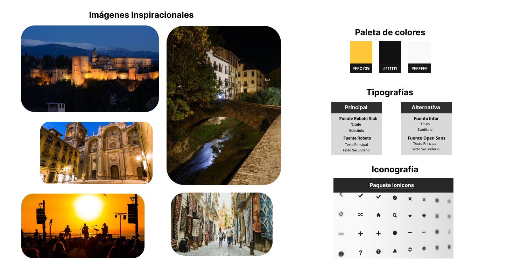
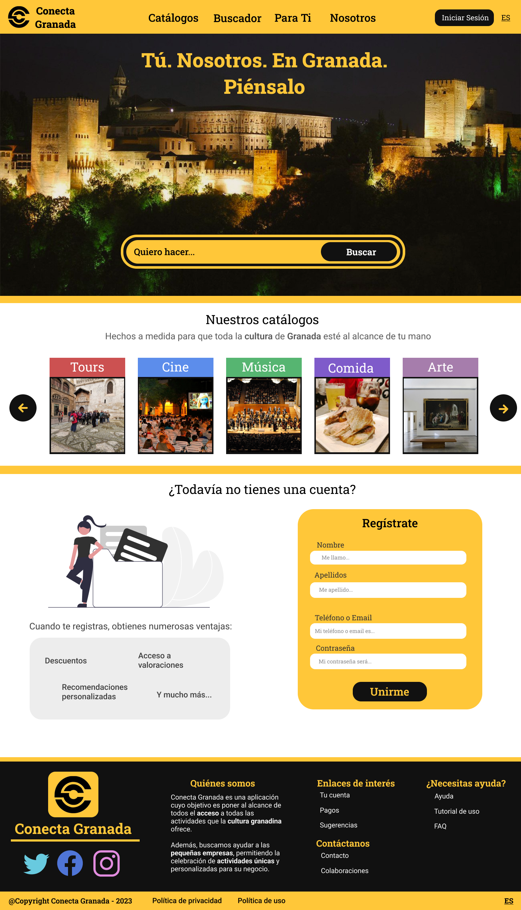
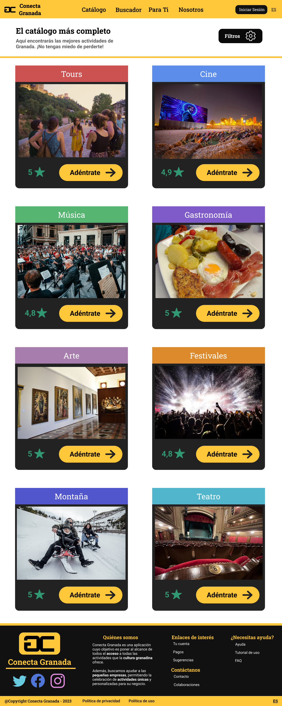
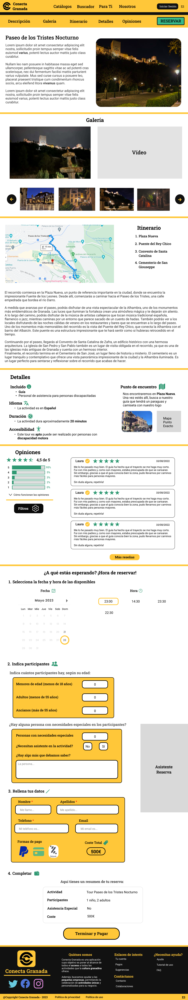
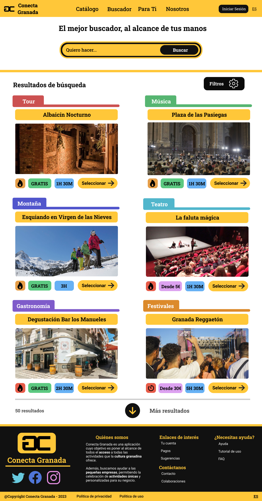

# DIU - Practica 3, entregables

En esta práctica, presentaremos una versión casi definitiva de Conecta Granada. Nuestro objetivo es que Conecta Granada sea una web moderna y agradable, accesible a cualquier tipo de persona.

## Moodboard (diseño visual + logotipo)   

Para ayudarnos a tomar las deciciones sobre el diseño visual, hemos empleado un Moodboard. De esta forma, hemos buscado imágenes inspiraciones, de las que hemos extraído una paleta con tres colores básicos:
- Amarillo: Nos recuerda al color de la Alhambra cuando se ilumina por la noche.
- Negro: Nos recuerda al hermoso cielo nocturno de Granada.
- Blanco: Nos recuerda a Sierra Nevada.
Estos tres colores han sido la base para el estilo principal de la página, así como de otros colores que surgen a partir de sus sombreados.

En lo que respecta a la tipografía, hemos optado por letras claras, no monoespaciadas. Por otro lado, un paquete de iconos minimalista nos ha permitido continuar con un estilo elegante y minimal.

Los códigos de color son:
- Amarillo (#FFC739)
- Negro (#111111)
- Blanco (#FFFFFF)

Las tipografías utilizadas son:
- Roboto Slab y Roboto
- Inter y Open Sans

Los iconos utilizados son de IONICONS, que ofrece iconos minimalistas en formato SVG y con colores neutros, que nos ha permitido modificar los colores para adaptarlos a nuestra paleta.

## Landing Page

En los bocetos LO-FI de la práctica anterior, planteamos una landing page (el home) con multitud de elementos y acciones. Sin embargo, hemos llevado a cabo un refinamiento para conseguir una landing page con unos CTA muy localizados:
- Búsqueda Instantánea: permite que recién llegados a la página, puedan empezar a buscar actividades.
- Iniciar Sesión: permite que los usuarios puedan iniciar sesión de forma rápida.
- Registro: permite que los usuarios puedan llevar a cabo un registro rápido.

Por otro lado, Granada, concretamente, la Alhambra, forma parte del primer vistazo que tendrán todos los usuarios, incorportando nuestro eslogan y nuestro maravilloso buscador.

Además, el landing page ofrece las principales opciones de navegación con una barra que, inicialmente, estará difuminada con la imagen, destacando el eslogan, el buscador y el inicio de sesión.

## Mockup: LAYOUT HI-FI

Centrándonos en la página como un todo, como hemos mencionado previamente, el negro le proporciona un toque moderno y elegante, al igual que el amarillo, añadiendo un tono alegre.
Sin embargo, para no hacer mucha sobrecarga (puesto que estos colores combinados pueden ser bastante pesados), el blanco proporciona el equilibrio.

En nuestro mockup, hemos desarrollado las páginas más importantes:
- Landing Page
- Catálogo
- Proceso de reserva en una actividad
- Buscador

Se han seleccionado estas páginas porque son las que aportan el mayor valor de cara al usuario final. También, la accesibilidad, ha sido uno de los puntos clave durante el diseño.

### Landing Page
Comentada en el apartado anterior.

### Catálogo
Con nuestro catálogo hemos intentado conseguir una visualización rápida de todas las categorías de actividades. Las categorías de actividades facilitan la organización de cara a los usuarios. Además, nos permite añadir una calificación media. 
En lo que respecta al diseño de cada categoría, hemos empleado un color llamativo y una imagen promocional. También, la paleta de colores utilizada, permite una rápida localización de los botones para las CTA.

Por último, mencionar los filtros, que permiten hacer un filtrado de las categorías ofrecidas, ya sea por popularidad, calificación, etc.

### Proceso de reserva

El proceso de reserva es la parte más importante de la página, puesto que es donde se concentran las acciones principales de todos los tipos de usuarios que esperamos.

Es por ello que hemos priorizado dos puntos:
- Eficiencia: con eficiencia nos referimos a que los usuarios pueden rápidamente realizar una reserva, así como consultar las distintas secciones de la página, con un menú en forma de barra que, al pulsar una opción, te lleve directamente a la sección correspondiente.
- Accesibilidad: una de las principales críticas que teníamos hacia los competidores era la falta de información para personas con necesidades especiales, así como carencias en los estilos empleados. Es por eso que hemos añadido gran cantidad de información, que permita una accesibilidad total.

Por otro lado, el formulario de reserva se ha mantenido en la misma página, evitando confusiones por parte de los usuarios. También, hemos añadido un asistente automático de reserva, capaz de responder las dudas y ofrecer una guía durante este procedimiento. Además, en caso de que haya algún problema con algún campo, se encargará de resaltarlo para hacerlo más visible al usuario.

### Buscador

El buscador es otra de las partes más criticadas en la competencia. Es por eso que hemos diseñado un buscador rápido, cómodo y fácil de utilizar, con un estilo único.

De este modo, hemos incluido la información clave que necesita el usuario para que, de un vistazo rápido, pueda saber qué actividad se adapta mejor a sus gustos. A esto tenemos que añadirle la posibilidad de emplear los filtros, acelerando aún más el proceso.

Finalmente, destacar que, en caso de que haya un gran número de resultados, se empleará un botón que cargará la siguiente sección de resultados.

## Documentación: Publicación del Case Study

## Principales Dificultades

## Conclusión y Valoración

