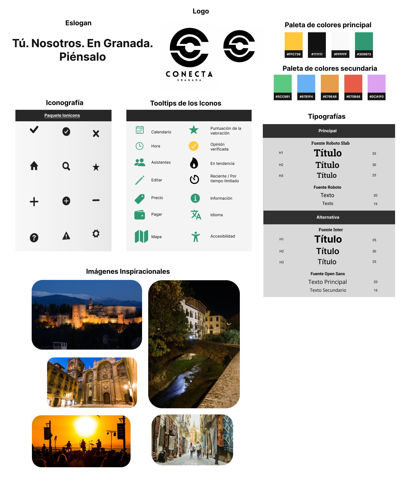

# DIU - Practica 3, entregables

En esta práctica, presentaremos una versión casi definitiva de Conecta Granada. Nuestro objetivo es que Conecta Granada sea una web moderna y agradable, accesible a cualquier tipo de persona.

## Moodboard (diseño visual + logotipo)   

Para ayudarnos a tomar las deciciones sobre el diseño visual, hemos empleado un Moodboard. De esta forma, hemos buscado imágenes inspiraciones, de las que hemos extraído una paleta con tres colores básicos:
- Amarillo: Nos recuerda al color de la Alhambra cuando se ilumina por la noche.
- Negro: Nos recuerda al hermoso cielo nocturno de Granada.
- Blanco: Nos recuerda a Sierra Nevada.
Estos tres colores han sido la base para el estilo principal de la página, así como de otros colores que surgen a partir de sus sombreados.

En lo que respecta a la tipografía, hemos optado por letras claras, no monoespaciadas. Por otro lado, un paquete de iconos minimalista nos ha permitido continuar con un estilo elegante y minimal.

Los códigos de color son:
- Amarillo (#FFC739)
- Negro (#111111)
- Blanco (#FFFFFF)

Las tipografías utilizadas son:
- Roboto Slab y Roboto
- Inter y Open Sans

Los iconos utilizados son de IONICONS, que ofrece iconos minimalistas en formato SVG y con colores neutros, que nos ha permitido modificar los colores para adaptarlos a nuestra paleta.

## Landing Page

En los bocetos LO-FI de la práctica anterior, planteamos una landing page (el home) con multitud de elementos y acciones. Sin embargo, hemos llevado a cabo un refinamiento para conseguir una landing page con unos CTA muy localizados:
- Búsqueda Instantánea: permite que recién llegados a la página, puedan empezar a buscar actividades.
- Iniciar Sesión: permite que los usuarios puedan iniciar sesión de forma rápida.
- Registro: permite que los usuarios puedan llevar a cabo un registro rápido.

Por otro lado, Granada, concretamente, la Alhambra, forma parte del primer vistazo que tendrán todos los usuarios, incorportando nuestro eslogan y nuestro maravilloso buscador.

Además, el landing page ofrece las principales opciones de navegación con una barra que, inicialmente, estará difuminada con la imagen, destacando el eslogan, el buscador y el inicio de sesión.

## Mockup: LAYOUT HI-FI

## Documentación: Publicación del Case Study

(incluye) Valoración del equipo sobre la realización de esta práctica o los problemas surgidos
 
