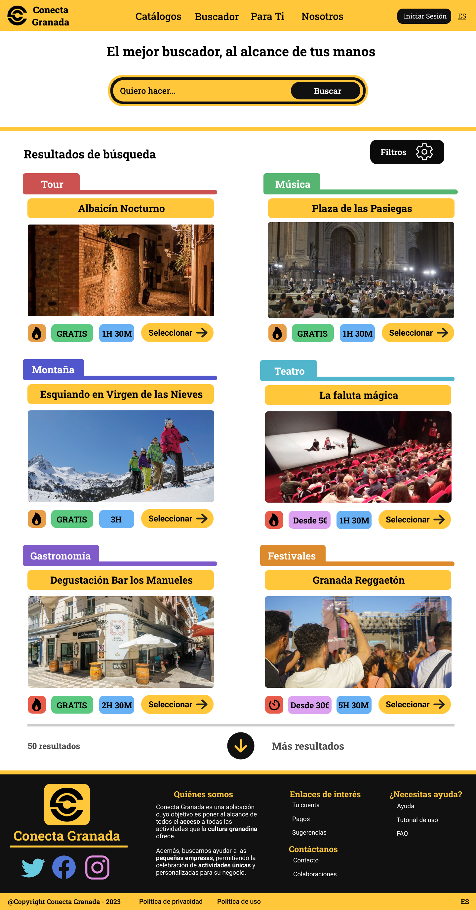

# DIU - Practica 3, entregables

En esta práctica, presentaremos una versión casi definitiva de Conecta Granada. Nuestro objetivo es que Conecta Granada sea una web moderna y agradable, accesible a cualquier tipo de persona.

## Moodboard (diseño visual + logotipo)   

Para ayudarnos a tomar las deciciones sobre el diseño visual, hemos empleado un Moodboard, donde, a partir de una serie de imágenes que consideramos representativas, hemos obtenido una paleta de colores.

### Test de Contraste
Para comprobar que los colores empleados iban a hacer un buen contraste, hemos utilizado la web [WebAIM: Contrast Checker](https://webaim.org/resources/contrastchecker/), que, al probar las combinaciones de color que íbamos a realizar, nos ha dado como resultado WCAG AAA, que significa que nuestra web es muy accesible en lo que respecta a la visualización de los elementos en pantalla.

## Landing Page

En nuestra landing page...

## Guidelines
### Estilo
A partir del Moodboard, hemos determinado los elementos base de diseño de nuestra página.

La paleta de color empleada estará formada por:
- **Amarillo:** Nos recuerda al color de la Alhambra cuando se ilumina por la noche.
- **Negro:** Nos recuerda al hermoso cielo nocturno de Granada.
- **Blanco:** Nos recuerda a Sierra Nevada.
Estos tres colores han sido la base para el estilo principal de la página, así como de otros colores que surgen a partir de sus sombreados y combinaciones. También, gracias a la buena combinación de estos colores, podremos añadir secciones con más diversidad de color sin preocuparnos por el contraste.

En lo que respecta a la tipografía, hemos optado por letras claras, no monoespaciadas, que faciliten la lectura. Finalmente, los iconos utilizados son minimalistas y sencillos, lo que nos ha permitido cambiar sus colores y adaptarlos a nuestras necesidades.

Los códigos de color son:
- **Amarillo** `#FFC739`
- **Negro** `#111111`
- **Blanco** `#FFFFFF`

Las tipografías utilizadas son:
- **Roboto Slab y Roboto:** será la tipografía principal utilizada. Muy legible y clara.
- **Inter y Open Sans:** se propone como tipografía alternativa.

Los iconos utilizados son de [Ionicons](https://ionicons.com/), que ofrece iconos minimalistas en formato SVG y colores neutros.

### Layout
En lo que respecta al diseño del layout, teniendo en cuenta que nuestro objetivo es crear una página web responsiva, capaz de adaptarse a móviles, hemos considerado varias pautas de diseño para lograrlo.

#### Claridad visual
Nuestro diseño busca que los objetos cercanos se perciban como un único estímulo, así como mantener cada elemento encapsulado mediante delimitadores visuales. De esta forma, la percepción por parte de los usuarios será uniforme y se acentuará en los elementos que más destaquen.

#### Formato y consistencia visual
La consistencia visual la hemos conseguido empleando una paleta de colores de forma uniforme, así como manteniendo un estilo a lo largo de las distintas páginas.
A esto hay que añadir la simetría y el balanceado, bases de nuestro diseño al no dejar grandes espacios libres y mantener un eje de simetría central.

Para dirigir la atención del usuario a las áreas más relevantes, hemos buscado una experiencia visual llena de contenido, sin olvidar la acentuación, conseguida al emplear el amarillo como contraste principal sobre el negro.

Por otro lado, los iconos nos han ayudado a definir, clarificar y colorear las principales áreas de uso donde los usuarios pasarán más tiempo.

#### Patrones de diseño
Para ejecutar el diseño, hemos empleado patrones / elementos muy conocidos:
- Barra de navegación flotante
- Lista en cascada para el buscador
- Carrusel de imágenes
- Carrusel para los mini-catálogos (en el home)
- Tags identificativos para las actividades
- ETC.

## Mockup: LAYOUT HI-FI

En nuestro mockup, hemos desarrollado las páginas más importantes:
- Landing Page
- Catálogo
- Proceso de reserva en una actividad
- Buscador

Se han seleccionado estas páginas porque son las que aportan el mayor valor de cara al usuario final. También, la accesibilidad, ha sido uno de los puntos clave durante el diseño.

### Landing Page Completa
En los bocetos LO-FI de la práctica anterior, planteamos nuestra Landing Page con multitud de elementos y acciones. Sin embargo, hemos llevado a cabo un refinamiento para conseguir una landing page con unos CTA muy localizados:
- **Búsqueda Instantánea:** permite que recién llegados a la página, puedan empezar a buscar actividades.
- **Iniciar Sesión:** permite que los usuarios puedan iniciar sesión de forma rápida.
- **Registro:** permite que los usuarios puedan llevar a cabo un registro rápido.

Por otro lado, Granada, concretamente, la Alhambra, forma parte del primer vistazo que tendrán todos los usuarios, incorportando nuestro eslogan y nuestro maravilloso buscador.

### Catálogo
Con nuestro catálogo hemos intentado conseguir una visualización rápida de todas las categorías de actividades. Las categorías de actividades facilitan la organización de cara a los usuarios. Además, nos permite añadir una calificación media. 
En lo que respecta al diseño de cada categoría, hemos empleado un color llamativo y una imagen promocional. También, la paleta de colores utilizada, permite una rápida localización de los botones para las CTA.

Por último, mencionar los filtros, que permiten hacer un filtrado de las categorías ofrecidas, ya sea por popularidad, calificación, etc.

### Proceso de reserva

El proceso de reserva es la parte más importante de la página, puesto que es donde se concentran las acciones principales de todos los tipos de usuarios que esperamos.

Es por ello que hemos priorizado dos puntos:
- **Eficiencia:** con eficiencia nos referimos a que los usuarios pueden rápidamente realizar una reserva, así como consultar las distintas secciones de la página, con un menú en forma de barra que, al pulsar una opción, te lleve directamente a la sección correspondiente.
- **Accesibilidad:** una de las principales críticas que teníamos hacia los competidores era la falta de información para personas con necesidades especiales, así como carencias en los estilos empleados. Es por eso que hemos añadido gran cantidad de información, que permita una accesibilidad total.

Por otro lado, el formulario de reserva se ha mantenido en la misma página, evitando confusiones por parte de los usuarios. También, hemos añadido un asistente automático de reserva, capaz de responder las dudas y ofrecer una guía durante este procedimiento. Además, en caso de que haya algún problema con algún campo, se encargará de resaltarlo para hacerlo más visible al usuario.

### Buscador

El buscador es otra de las partes más criticadas en la competencia. Es por eso que hemos diseñado un buscador rápido, cómodo y fácil de utilizar, con un estilo único.

De este modo, hemos incluido la información clave que necesita el usuario para que, de un vistazo rápido, pueda saber qué actividad se adapta mejor a sus gustos. A esto tenemos que añadirle la posibilidad de emplear los filtros, acelerando aún más el proceso.

Finalmente, destacar que, en caso de que haya un gran número de resultados, se empleará un botón que cargará la siguiente sección de resultados.

## Documentación: Publicación del Case Study

## Principales Dificultades

Durante el diseño del sitio, una de las principales dificultades ha sido la elección de la paleta de colores, puesto que buscábamos un estilo muy diferenciado pero tampoco muy sobrecargado.
Otra dificultad ha sido el diseño del logo, ya que, habiendo decidido un estilo minimalista, queríamos un logo que representara la conexión de las personas con la cultura granadina. A pesar de ello, hemos sido capaces de diseñar un logo sencillo y que simboliza nuestro objetivo.

## Conclusión y Valoración

Finalmente, consideramos que hemos logrado un diseño acorde a nuestras expectativas, con una correcta combinación de colores. Además, priorizar la accesibilidad nos ha permitido diseñar pensando en la usabilidad por parte del usuario final, lo que ha evitado cometer los errores que hemos criticado en la competencia.

Prueba de ello han sido los resultados de los tests, como el de contraste, que califica el diseño (en términos de paleta de color) como WCAG AAA.

Por otro lado, en lo que respecta el aspecto visual, creemos que nuestra propuesta destaca por su diseño único y moderno, empleando colores simples y manteniendo una estética uniforme a lo largo de todo el sitio.
