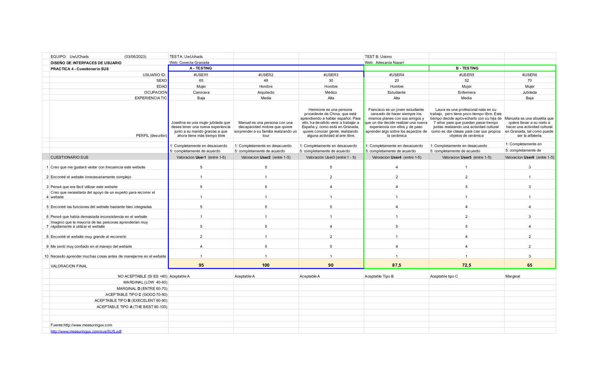

# DIU - Practica 4, entregables

## Usuarios 

Para hacer el A/B Testing, hemos seleccionado 6 usuarios con distintas edades y conocimientos técnicos. 2 de esos usuarios son personas reales, que hemos entrevistado, Laura y Francisco. Los otros 4 usuarios, 2 de ellos son nuestras personas ficticias y 2 obtenidos a través de Role Playing con los dados.

De los dados, hemos sacado dos usuarios:
- **Hermión (Caso A):** 1, 2, 3. Hermione es una persona procedente de China, que está aprendiendo a hablar español. Para ello, ha decidido venir a trabajar a España y, como está en Granada, quiere conocer gente, realizando alguna actividad al aire libre. Su ocupación actual es médico, y tiene mucho conocimiento técnico, gracias en parte a su juventud.
- **Manuela (Caso B):** 2, 3, 6. Manuela es una abuelita que quiere llevar a su nieto de 6 años a una actividad de alfarería, para que aprenda la importancia del trabajo artesanal y pueda llevarse un recuerdo. No tiene casi experiencia con el uso de páginas web.

## Test SUS: A/B Testing
#### Descripción Inicial
El Caso B, trata sobre Artesanía Nazarí [DIU3_Uxiono](https://github.com/ArturoAcf/DIU_Uxiono). Esta aplicación permite reservar actividades artesanales en Granada, principalmente la cerámica. Su enfoque es ofrecer un servicio innovador a través de sus talleres.
Como su idea de negocio necesita recabar usuarios, es fundamental realizar diversos Tests (como puede ser el SUS o el de compartición) para conocer la usabilidad de la página web y la posible experiencia de los usuarios.

### Realización del test
Vamos a realizar el test sus con nuestros 6 usuarios, para posteriormente sacar conclusiones de los resultados obtenidos.
- [PDF](./TestSUS.pdf)

### Conclusiones del test
Tras realizar el test, vamos a analizar los resultados obtenidos.

#### Test A
En el Test A, hemos contado con 3 usuarios, con distinta edad y conocimientos técnicos.

- **Usuario 1 - Valor SUS 95:** Indica que este usuario percibe la usabilidad de esta aplicación como altamente usable, eficiente y satisfactoria.
Al principio Josefina se sentía un poco desorientada y con miedo de usar la aplicación web, pero gracias al diseño de la aplicación, sobre todo con sus colores y botones, le ha resultado fácil conseguir su objetivo.

- **Usuario 2 - Valor SUS 100:** Indica que este usuario percibe la usabilidad de esta aplicación como altamente usable, eficiente y satisfactoria.
Manuel se sentía confiado y con ganas de tener una nueva experiencia y, gracias a la adaptabilidad de la página con respecto a su discapacidad motora, ha conseguido realizar la reserva de la actividad que deseaba realizar.

- **Usuario 3 - Valor SUS 90:** Indica que este usuario percibe la usabilidad de esta aplicación como altamente usable, eficiente y satisfactoria.
Inicialmente, Hermione se sentía ilusionado porque iba a poder realizar una actividad donde conocería gente y podría practicar el idioma. Gracias al correcto diseño de la página web, ha podido lograr su objetivo sin dificultades.

Podemos concluir que, gracias al diseño sencillo y uniforme de nuestra página web, los usuarios han logrado su objetivo, reservar una actividad, conociendo todos los detalles acerca de la misma, de manera rápida y fluida. Estamos contentos con el resultado, puesto que, algo que criticábamos de nuestros competidores era la lentitud y dificultad de este proceso.

#### Test B
En el Test B, hemos contado con otros 3 usuarios, de distinta edad y conocimientos técnicos.

- **Usuario 4 - Valor SUS 87.5:** Un puntaje de 87.5 indica que este usuario ha respondido de manera positiva a las afirmaciones del cuestionario, lo que implica que ha experimentado una buena facilidad de uso y ha quedado satisfecho con la interacción con el sistema evaluado.
Francisco tenía ganas de cambiar de aires y realizar una actividad distinta con sus amigos, por lo tanto se sentía motivado. El proceso de reserva le resultó bastante sencillo dado su nivel de uso de la tecnología web y mantiene su motivación inicial.

- **Usuario 5 - Valor SUS 72.5:** Indica que el usuario puede haber encontrado algunos aspectos del sistema que podrían mejorarse para brindar una experiencia de usuario más satisfactoria. Es posible que haya habido ciertas dificultades o áreas de confusión durante la interacción con el sistema.
Laura tenía muchas ganas de realizar una actividad distinta con su hija, sin embargo, debido al texto de descripción de la web se sintió un poco incómoda y decidió no finalizar el proceso de reserva, ya que, consideraba los textos un poco obscenos.

- **Usuario 6 - Valor SUS 65:** Un puntaje de 65 indica que el usuario ha respondido de manera negativa o neutral a varias afirmaciones del cuestionario, lo que implica que ha enfrentado obstáculos y ha tenido una experiencia problemática durante la interacción con el sistema.
Manuela se sentía triste e insegura porque no estaba segura de si iba a saber utilizar correctamente el sitio web. Debido a sus problemas de visión, tuvo algunas dificultades para ver algunos títulos y leer los textos, por tener una fuente en negrita con letras muy pegadas. Sin embargo, con un poco de ayuda de su hija, logró reservar una actividad para su nieto.

Podemos concluir que, a pesar del diseño sencillo del sitio, hay algunas carencias en lo que respecta al seccionamiento y al estilo de algunos elementos, principalmente el contraste y tipo de fuente utilizada, que provocan confusiones y pérdidas, hasta en lo susuarios más experimentados. Sin embargo, no son errores que impidan en gran medida el cumplimiento de los objetivos individuales de cada usuario.

## Usability Report del Caso B (Artesanía Nazarí)
[Usability Report](./InformeUsabilidadB-P4.pdf)

En nuestro Usability Report, hemos detallado el análisis realizado sobre el caso B (Artesanía Nazarí, DIU3 Uxionos), dando recomendaciones para solucionar esos pequeños fallos que han perjudicado la experiencia de los usuarios. Nos gustaría destacar que, a pesar de ello, los usuarios han conseguido realizar su objetivo, reservar un taller y/o comprar productos, pero que, con las mejoras que proponemos, garantizarán que todos los usuarios tengan una experiencia fluida.

## Conclusiones
Como conclusión, gracias a la realización del A/B Testing y el Test SUS hemos podido comprobar de forma realista la usabilidad de nuestro sitio web, cuyo resultado ha sido gratificante, puesto que implica que hemos logrado nuestro objetivo, un sitio web accesible para todo tipo de personas, con una experiencia rápida y fluida.

Por otro lado, hemos tenido la oportunidad de evaluar el sitio web de Artesanía Nazarí, con un diseño muy bonito pero que, debido a fallos como la fuente utilizada o el bajo contraste entre algunas imágenes y textos, perjudican la experiencia de los usuarios. Es por eso que, realizando un análisis más en detalle, hemos sacado una lista de recomendaciones que pueden mejorar enormemente la experiencia, potenciando aún más la armonía de su diseño con el producto ofrecido.

