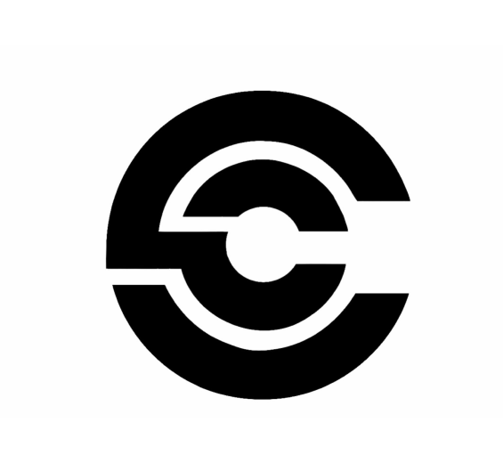
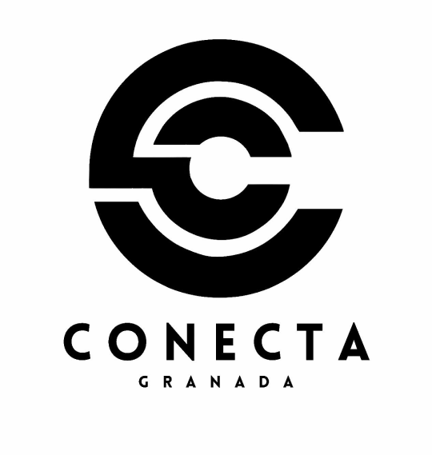
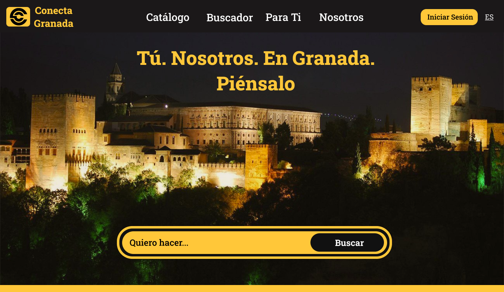
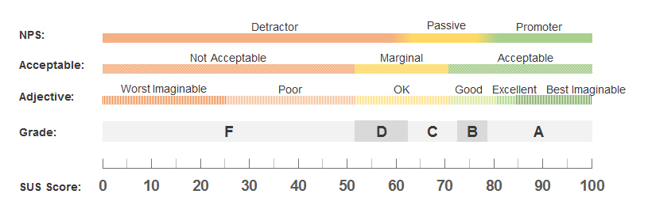

# DIU23
Prácticas Diseño Interfaces de Usuario 2022-23 (Tema: Tours por Granada) 

Grupo: DIU2_UwUchads  Curso: 2022/23 
Updated: 08/03/2023

Proyecto: 
**Conecta Granada**

Descripción: 

Nuestra proyecto se basa en la creación de una aplicación donde no sólo se puedan realizar tours, sino que se puedan realizar todo tipo de actividades 
por Granada. Así, surge nuestra propuesta, que priorizará la accesibilidad de los usuarios a todas las actividades culturales que Granada puede ofrecer.

Además, la colaboración con las pequeñas empresas será uno de los incentivos para fomentar la creación y mejora de nuevas actividades culturales.

Logotipo:
 

Miembros
 * :bust_in_silhouette: [Jaime Pérez García](https://github.com/JaimeUGR) :octocat:     
 * :bust_in_silhouette: [Francisco Expósito Carmona](https://github.com/francx11) :octocat:

----- 

# Proceso de Diseño 

## Paso 1. UX Desk Research & Analisis 

 1.a Competitive Analysis
-----

Hemos hecho una comparación entre los principales resultados al buscar por Internet Tours gratis por Granada. La comparación se ha realizado entre:
- [FreeTour](https://freetour-granada.com/)
- [BuendiaTours](https://buendiatours.com/es/granada)
- [WalkInGranada](https://walkingranada.com/)

De la comparación hemos sacado como conclusión que FreeTour está muy por detrás de los competidores y que, si lo que buscas es un tour por Granada,
la mejor opción es [BuendiaTours](https://buendiatours.com/es/granada), tanto por la calidad de la página web como por las actividades ofrecidas.

Si quieres observar el análisis de una forma más gráfica te recomendamos que hagas click en el siguiente enlace: [Competitor Analysis](./P1/CompetitorAnalysis.png)

 1.b Persona
-----

Para poder probar la accesibilidad que tiene la página de [FreeTour](https://freetour-granada.com/), hemos decidido elegir a dos personas que representan a dos colectivos distintos.

### Josefina
Josefina es una persona mayor, residente en Granada, que está jubilada y, ahora que tiene más tiempo libre, quiere disfrutar una experiencia
nueva. Por ese motivo, ha decicido reservar para participar en un tour, ya que ella siempre ha estado interesada en este tipo de actividades.

Puedes apreciar más detalles sobre su biografía así como sus gustos y habilidades haciendo click en el siguiente enlace: [Descripción de Josefina](./P1/Persona_Josefina.png)

### Manuel
Manuel es una persona que no vive en Granada, sino en Tarragona, Çataluña. Quiere sorprender a su familia con un pequeño viaje para conocer un lugar
turístico, por lo que está intentando reservar un tour a través de Internet.
Sin embargo, debido a la discapacidad motora de Manuel, es muy importante conocer de antemano si podrá realizar el tour.

Puedes apreciar más detalles sobre su biografía así como sus gustos y habilidades haciendo click en el siguiente enlace: [Descripción de Manuel](./P1/Persona_Manuel.png)

 1.c User Journey Map
----

### Josefina
La experiencia de Josefina es la más cercana a la que cualquier persona mayor que acceda a esta página tendrá que sufrir.

Puedes observar un cómo se va sintiendo Josefina y los problemas que le surgen a lo largo de su experiencia con la página web en el siguiente enlace: [Journey Map de Josefina](./P1/Journey_Josefina.png)

### Manuel
La experiencia de Manuel es muy cercana a la que experimentará:
- Una persona que debido a su discapacidad no sabe si puede realizar el Tour
- Una persona que no es de Granada

En el siguiente enlace: [Journey Map de Manuel](./P1/Journey_Manuel.png) , podrás comprobar cómo afecta a Manuel el hecho de ser una persona discapacitada a la hora de utilizar la página web.

 1.d Usability Review
----
Un punto muy importante dentro del análisis de una página web es su usabilidad. Para poder describir este aspecto hemos utilizado una plantilla con todos los puntos clave con los que debería contar una
página web y hemos sacado nuestras propias conclusiones acerca de [FreeTour](https://freetour-granada.com/)

Los principales factores negativos son:
- El rendimiento de la página es horrible
- Las múltiples redirecciones durante el proceso de reserva hacen que te pierdas
- No hay información detallada sobre los tours
- En dispositivos móviles la página web tiene problemas

Todo esto ha resultado en una valoración de 46 (sobre 100), que implica que la mayor parte de usuarios tendrán una experiencia negativa en esta página,
al igual que nosotros la hemos tenido.

## Paso 2. UX Design  

 2.a Feedback Capture Grid / EMpathy map / POV
----

Para comenzar nuestro proyecto, hemos creado una malla receptora de información, en la que hemos observado cuatro aspectos clave:

- "Like" (Gustos): En esta sección, hemos recopilado todas las ideas y características que nos han gustado de la competencia y que creemos que deben estar presentes en nuestro proyecto.
- "Wishes" (Deseos): Aquí hemos incluido todas las críticas que tenemos sobre la competencia y las áreas que creemos que se pueden mejorar o solucionar.
- "Questions" (Preguntas): En esta parte, hemos recopilado las preguntas que las personas ficticias se han hecho mientras utilizaban las aplicaciones de la  competencia.
- "Ideas" (Ideas): Basándonos en todo lo anterior, hemos incluido en esta sección las ideas que podemos implementar para hacer mejoras en nuestro proyecto.

En [Feedback Capture Grid](./P2/FeedbackCaptureGrid.png) encontrarás una imagen que deja de forma clara y visual los anteriores aspectos.

 2.b ScopeCanvas
----

Nuestra propuesta se trata de una aplicación sencilla, que agrupa todo tipo de actividades culturales en Granada. De esta forma, tanto el proceso de búsqueda
como de reserva estarán simplificados, ya que el usuario no tendrá que recurrir a agencias o buscar en miles de páginas.
Por otro lado, creemos que la capacidad de interacción entre los usuarios es fundamental, por lo que dentro de la propia aplicación podrás compartir tanto las actividades que más te gusten como fotos y vídeos tuyos realizándolas.
También, la facilidad para encontrar actividades afines a nuestros gustos es una tarea pendiente en nuestros competidores, que nosotros, resolveremos mediante un sistema de recomendación personalizado (a partir de un algoritmo).

Escuchando a nuestros usuarios (Manuel y Josefina), hemos visto que los dos principales problemas son:
- Falta de información acerca de los tours
- Dificultad en el proceso de reserva

Estos problemas los solucionaremos en conjunto, es decir, facilitaremos el proceso de reserva unificándolo con la página donde se encuentra la información de la actividad. Además, dicha información incluirá descripciones **detalladas** de la actividad, imágenes, vídeos, requisitos, preguntas frecuentes... junto a datos relacionados con el terreno, la dificultad y datos necesarios para personas con cualquier tipo de discapacidad.

Para gestionar nuestra propuesta, hemos hecho un roadmap, donde hemos especificado una serie de objetivos a corto, medio y largo plazo. Dichos objetivos se resumen en:
- A corto plazo nos gustaría tener una aplicación móvil integrada con la aplicación, ya que, de esta forma, facilitaríamos la expansión en múltiples plataformas al mismo tiempo. Por otro lado, el sistema de recomendaciones personalizadas y el perfil de usuario son fundamentales para lograr la interacción e implicación que buscamos entre los usuarios. También, la realización de actividades únicas (tales como eventos), ayudarán a atraer nuevos usuarios.
- A medio plazo nos gustaría incorporar un servicio de ayuda automático en nuestra aplicación, que sea capaz de guiarte si te has perdido.
- A largo plazo nos gustaría realizar contratos y colaboraciones con grandes marcas y empresas, de forma que podamos expandir el rango de nuestras actividades de Granada a un ámbito nacional e internacional.

Puedes observar todo lo descrito anteriormente y más en el siguiente enlace: [Scope Canvas](./P2/ScopeCanvas)

 2.b Tasks analysis 
-----

Para analizar las tareas de nuestros usuarios, hemos decidido crear una Task Matrix. Esto consiste en una matriz donde ordenamos las tareas que se realizarán en nuestra aplicación según momentos temporales, para poder saber qué acciones son las que se realizan con mayor frecuencia.

De esta forma, hemos representado las acciones principales que todo tipo de usuario tendrá, categorizado en 4 grupos:
- Usuario buscando una actividad: estos usuarios pueden estar o no registrados, siendo su principal interés el encontrar una actividad que realizar.
- Usuario antes de realizar una actividad: estos usuarios ya han reservado una actividad (o están en proceso), siendo su principal interés informarse y compartirla con sus amigos.
- Usuario durante la realización de una actividad: estos usuarios están realizando una actividad, siendo su principal interés compartir lo que están haciendo.
- Usuario tras la realización de una actividad: estos usuarios han terminado una actividad, siendo su principal interés encontrar nuevas actividades que realizar, utilizando los buscadores y mirando las recomendaciones.

En [Task Matrix](./P2/TaskMatrix.png) encontrarás de una forma muy clara y visual cómo se ordenan las acciones según su frecuencia de uso en la aplicación.

De esta forma, hemos conseguido localizar las actividades más importantes (subrayadas en negrita), que formarán parte del uso habitual de los usuarios.

 2.c IA: Sitemap + Labelling 
----
#### Sitemap
Con un Sitemap, y en concreto con el nuestro, queremos mostrar la funcionalidad general de nuestra aplicación, dividida en varios apartaddos para que el usuario tenga opción de elegir el apartado más conveniente para su uso. Además, la parte relacionada con el contacto y la gestión del perfil están reservadas para sus apartados correspondientes.

En [Sitemap](./P2/Sitemap.png) se muestra de forma muy clara la estructura general de nuestra aplicación.

Este diseño lo hemos orientado de forma que el usuario tenga la mayor facilidad posible para:
- Buscar las actividades que quiere
- Sumergirse en el catálogo buscando actividades
- Reservar rápidamente
- Gestionar su perfil de forma cómoda y sencilla

#### Labelling
Con el Labelling, queremos conseguir etiquetar y describir cada uno de los apartados que aparecen en el esquema general del Sitemap, para que quede claro a qué se refiere cada uno.

Si accedes a [Labelling](./P2/Labelling.png), podrás encontrar una tabla que describe cada uno de los aspectos anteriormente mencionados.

 2.d Wireframes
-----

Hemos creado una serie de bocetos Lo-Fi, que nos han permitido esquematizar el diseño de la página web, donde hemos destacado las partes más importantes:
- Home (Landing Page)
- Catálogo
- Lista de actividades de una categoría específica
- Información actividad + Reserva

Cabe destacar que estos bocetos son puramente ilustrativos y no pretenden mostrar el estilo final de la página. Además, los colores utilizados son para seccionar la página, facilitando su posterior refinamiento.

#### Home
Puedes encontrar cómo se vería la página principal en: [Home](./P2/BocetoHome.png)

#### Catálogo General
Puedes encontrar cómo se vería el catálogo general donde están las distintas categorías de actividades en: [Catálogo General](./P2/BocetoCatalogo.png)

#### Catálogo de Tours
Para ver los distintos tours que se encunetran disponibles puedes apreciar cómo se verían en: [Catálogo de tours](./P2/BocetoCatalogoTours.png)

#### Reserva de Tour
Puedes encontrar un esquema de cómo se realizaría la reserva de un tour en: [Reserva de tour](./P2/BocetoReservaTour.png)

## Paso 3. Mi UX-Case Study (diseño)

 3.a Moodboard
-----
En primer lugar, decidimos diseñar un logo minimalista, ya que estábamos buscando un estilo sencillo. De este proceso obtuvimos un logo que representaba a nuestra marca, una especie de C que abstrae la conexión de las personas con Granada.
Además, encontramos un eslogan que une a nuestros clientes, nosotros como intermediarios y Granada, fortaleciendo aún más las bases del proyecto, las personas y Granada. También, tiene un cierto punto humorístico, lo que nos hizo quedarnos con él. Dicho eslogan es: **Tú. Nosotros. En Granada. Piénsalo**".

Habiendo decidido logo y eslogan, saber qué estilo visual y elementos principales queríamos, empezamos a buscar algunas imágenes inspiraciones. Como queríamos un estilo elegante y minimalista (por el logo), con muy buen contraste, de nuestras imágenes determinamos que la paleta principal debería estar formada por negro, amarillo y blanco, los colores del cielo nocturno, las nubes del día y el atardecer, una forma de representar actividades que se realizan en todos los momentos del día.

Además de esos colores principales, también decidimos añadir otros colores que contrastaran con los principales, que utilizaríamos para simbolizar algunos botones e iconos.

En lo que respecta a la tipografía, creemos que Roboto Slab y Roboto son las que mejor quedan con nuestro estilo minimalista y elegante, además de una muy buena visibilidad. Hemos propuesto un estilo alternativo, algo menos elegante, pero que puede ser utilizado en caso de no estar disponible el principal.

Finalmente, para los iconos, encontramos un paquete de iconos minimalista con iconos en SVG, lo que nos ha permitido escalarlos y colorearlos a nuestro gusto.

  3.b Landing Page
----
Para el diseño de nuestra landing page, hemos aprovechado nuestra paleta de colores junto a una imagen representativa de Granada y nuestro eslogan para dar un potente impacto inicial al usuario, destacando sobre todos los elementos visuales:
- Nuestro eslogan
- Nuestro buscador (CTA Principal)
- Posibilidad de iniciar sesión rápidamente (CTA Secundario)

Además, queríamos añadir también la barra de navegación fundida con la imagen para mostrar las secciones principales desde el inicio en que entras a la página. La imagen elegida hace muy buen contraste con los textos que hay sobre ella, así como aportar una sensación de uniformidad al tener colores equivalentes con la paleta.

 3.c Guidelines
----
Para proseguir con el diseño de la página, hemos intentado seguir guidelines que nos permitieran conseguir un diseño elegante, minimalista y moderno, sin sobrecarga de elementos. Además, una buena accesibilidad a todos los elementos y la uniformidad en el estilo han sido puntos decisivos para los patrones a utilizar.

### Layout
En lo que respecta al diseño del layout, teniendo en cuenta que nuestro objetivo es crear una página web responsiva, capaz de adaptarse a móviles, hemos considerado varias pautas de diseño para lograrlo.

#### Claridad visual
Nuestro diseño busca que los objetos cercanos se perciban como un único estímulo, así como mantener cada elemento encapsulado mediante delimitadores visuales. De esta forma, la percepción por parte de los usuarios será uniforme y se acentuará en los elementos que más destaquen.

#### Formato y consistencia visual
La consistencia visual la hemos conseguido empleando una paleta de colores de forma uniforme, así como manteniendo un estilo a lo largo de las distintas páginas.
A esto hay que añadir la simetría y el balanceado, bases de nuestro diseño al no dejar grandes espacios libres y mantener un eje de simetría central.

Para dirigir la atención del usuario a las áreas más relevantes, hemos buscado una experiencia visual llena de contenido, sin olvidar la acentuación, conseguida al emplear el amarillo como contraste principal sobre el negro. En esta experiencia, nos hemos asegurado de evitar la sobrecarga de elementos.

Por otro lado, los iconos nos han ayudado a definir, clarificar y colorear las principales áreas de uso donde los usuarios pasarán más tiempo.

#### Patrones de diseño
Para ejecutar el diseño, hemos empleado patrones / elementos muy conocidos:
- Barra de navegación flotante
- Lista en cascada para el buscador
- Carrusel de imágenes
- Carrusel para los mini-catálogos (en el home)
- Tags identificativos para las actividades
- ETC.

  3.d Mockup
----

Siguiendo las guidelines, hemos diseñado los elementos principales de nuestra propuesta, con un estilo moderno y colores elegantes.
El mockup está compuesto por:
- [LandingPage Vista Scroll](./P3/Landing.png)
- [Catálogos](./P3/Catalogos.png)
- [Catálogo Tours](./P3/CatalogoTours.png)
- [Actividad Tour](./P3/Tour.png)
- [Buscador](./P3/Buscador.png)
- [Para Ti](./P3/ParaTi.png)
- [Nosotros](./P3/Nosotros.png)
- [Perfil](./P3/Perfil.png)
- [Iniciar Sesión](./P3/IniciarSesion.png)
- [Filtros](./P3/Filtros.png)

De todas estas páginas, la más importante es la de búsqueda de actividades y la de reserva de actividades, puesto que las principales tareas de los usuarios se concentran aquí.

Para simplificar la búsqueda de actividades, hay una serie de indicadores bajo las actividades que indican información como el precio, si es gratis, la duración, si es tendencia, etc. Todos estos indicadores además, incluyen un tooltip que explican su contenido. Además, se pueden utilizar los filtros para cambiar los indicadores mostrados.

En lo que respecta a la reserva de actividades, un asistente ayudará al usuario a la hora de poner los datos de la reserva. Además, toda la información necesaria se encuentra en la misma página, evitando confunsiones y/o pérdidas debidos a múltiples cambios de página.

Finalmente, para facilitar la visualización, recomendamos utilizar el protipo que hemos creado. Para navegar la página, pulsa en los distintos botones de navegación y otros interactuables en pantalla (pulsa en cualquier lado para que salga un cuadro azul que los marque).

[PROTOTIPO](https://www.figma.com/proto/CGnqKBesW4RV1zjDJ2Iges/P3_Pagina?page-id=0%3A1&type=design&node-id=1-4&viewport=1501%2C951%2C0.32&scaling=scale-down&starting-point-node-id=1%3A4)

 3.e ¿My UX-Case Study?
-----

## Paso 4. Evaluación 

 4.a Caso asignado
El caso asignado es la página web de Artesanía Nazarí (DIU3_Uxiono). Esta aplicación permite reservar actividades artesanales en Granada, principalmente la cerámica. Su enfoque es ofrecer un servicio innovador a través de sus talleres. Como su idea de negocio necesita recabar usuarios, es fundamental realizar diversos Tests (como puede ser el SUS o el de compartición) para conocer la usabilidad de la página web y la posible experiencia de los usuarios.

[Artesanía Nazarí](https://github.com/ArturoAcf/DIU_Uxiono/tree/master)

 4.b User Testing
Hemos seleccionado 6 usuarios, de distinta edad y conocimiento técnico, para abarcar un gran rango de posibles colectivos interesados en el uso de las aplicaciones.
 

| Usuarios | Sexo/Edad     | Ocupación   |  Exp.TIC    | Personalidad | Plataforma | TestA/B
| ------------- | -------- | ----------- | ----------- | -----------  | ---------- | ----
| Josefina  | M / 65   | Jubilada  | Alta       | Vivaz | Web       | A 
| Manuel | H / 48   | Arquitecto  | Media       | Introvertido       | Web        | A 
| Hermione  | M / 30   | Médico     | Baja        | Emocional    | Web     | A
| Francisco  | H / 20   | Estudiante  | Alta       | Racional     | Web       | B 
| Laura  | M / 52   | Enfermera  | Media       | Impaciente     | Web        | B 
| Manuela  | M / 70   | Jubilada  | Baja       | Tranquila     | Web        | B 

. 4.c Cuestionario SUS
----
Usaremos el **Cuestionario SUS** para valorar la satisfacción de cada usuario con el diseño (A/B) realizado. Este test consiste en un cuestionario con 10 preguntas, calificadas numéricamente del 1-5, que nos permitira cuantificar la usabilidad de ambos casos. 

Para realizar el cuestionario, le hemos pedido a los usuarios que realicen estas actividades:
- Utilizar el buscador
- Visitar los distintos catálogos de actividades disponibles
- Reservar una actividad
- Iniciar Sesión / Crear una cuenta

Tras la realización de este cuestionario, hemos obtenido el siguiente resultado: [Resultados](./P4/TestSUS.png)

Para facilitar la cuantificación de los resultados, utilizaremos la siguiente escala:

### Caso A (Conecta Granada)
En el Caso A, la media del valor SUS es de 92,5, por lo que los usuarios han valorado muy positivamente la usabilidad de la página, superando el excelente según la cuantificación adjetiva. Consideramos que hemos cumplido nuestro objetivo de diseño, puesto que estábamos buscando una página web accesible para todo tipo de personas, donde puedan realizar de forma cómoda y sencilla la reserva de una actividad, así como explorar para ver las distintas opcioens ofrecidas.

### Caso B (Artesanía Nazarí)
En el Caso B, la media del valor SUS es de 75. Aquí, encontramos que 2 usuarios han valorado positivamente la usabilidad de la página, lo que equivale al excelente - bien de la cuantificación adjetiva. Sin embargo, el otro usuario, ha valorado de forma neutra, el OK adjetivo, debido a su poca experiencia con el uso de páginas web, que, a pesar de la sencillez del sitio, ha supuesto un obstáculo para completar su objetivo.
Analizando la situación en detalle, hemos descubierto que todos los usuarios han experimentado problemas muy similares, lo que ha perjudicado la usabilidad del sitio web y, en consecuencia, su SUS Score.

 4.d Usability Report
----
Para analizar más en detalle la propuesta de [Artesanía Nazarí](https://github.com/ArturoAcf/DIU_Uxiono/tree/master), hemos hecho un Usability Report, donde detallamos información sobre los usuarios que han realizado el Test SUS, la metodología seguida y un análisis de Eye Tracking, así como algunas recomendaciones de mejora para aumentar el grado de usabilidad de la aplicación.

[Usability Report](./P4/P4_UsabReport_Artesania_Nazarí_doneby_DIU2_UwuChads.pdf)

## Valoración personal del caso B
Pensamos que el diseño de la página web es uniforme y atractivo, con colores relacionados con el producto que ofertan. Sin embargo, coincidimos en los problemas que han tenido los usuarios, principalmente con el contraste de algunos textos y con la fuente utilizada, debido al excesivo uso de la negrita. También, consideramos que facilitar la navegación con un seccionamiento más sencillo podría contribuir a una mejora sustancial en la usabilidad.

 5.a Eye Tracking
Habiendo realizado tests de usabilidad a nuestros usuarios, nos gustaría realizar un estudio sobre el comportamiento de nuestros usuarios utilizando tecnología de trazamiento ocular sobre nuestro prototipo. Para ello, hemos empleado la herramienta [GazeRecorder](https://gazerecorder.com/). Sin embargo, hemos tenido problemas a la hora de utilizarla con nuestro protipo en figma, por lo que nos hemos visto obligados a utilizarla sobre imágenes del prototipo. Debido al funcionamiento de la herramienta, la resolución de las imágenes no se ajustaba correctamente a la calibración ocular, por lo que el resultado en los mapas de calor ha quedado distorsionado.

### Estudio
El estudio lo hemos realizado sobre dos usuarios, Francisco, joven con mucha experiencia tecnológica y web, y Laura, con experiencia intermedia y edad adulta. Hemos seleccionado estos dos usuarios porque creemos que representan el colectivo principal de usuarios de nuestra aplicación.
Las actividades que tenían que hacer:
- Visitar todas las páginas, estando en cada una de ellas 10-12 segundos.
- Consultar la información de una actividad (navegando desde la página principal, pasando por los catálogos)
  - Consultar la información acerca de la actividad
  - Consultar la información sobre el mapa, itinerario y elementos incluidos 
  - Realizar una reserva de una actividad
- Iniciar sesión en su perfil
- Consultar información sobre la empresa (Nosotros)

Los mapas de calor y AOI están en este archivo: [Eye Tracking](./P5/EyeTracking.pdf).

También, adjuntamos un vídeo con la interacción de Francisco [Video Eye Tracking Francisco](https://app.gazerecorder.com/Study/Player/?Watch=20230608_06402305ca608c-7fba-4143-b7a6-1748d010e55b)

### Conclusiones del estudio
Observando las interacciones de ambos usuarios, hemos comprobado que, a pesar del poco tiempo de visualización (10-12 segundos), han sido capaces de encontrar las interacciones principales y recorrer la página tal y como la habíamos diseñado. También, destacar que, durante el proceso de reserva, los usuarios han visualizado las distintas secciones según el flujo esperado. Además, el botón de reserva rápida en la barra inicial ha destacado lo suficiente como para que ambos usuarios lo hayan visto al inicio.

Finalmente, nos gustaría comentar que, debido a los problemas con la herramienta mencionados previamente, puede que los resultados no sean del todo fiables y sea necesario realizar el mismo estudio con una herramienta alternativa.

### Herramienta alternativa propuesta
Como herramienta alternativa de Eye Tracking, proponemos el uso de [RealEye](https://www.realeye.io/es/). Además de funcionar sobre prototipos figma (utilizando la url), nos permite crear estudios y compartir un enlace a ese estudio, facilitando el acceso de los participantes. Sin embargo, para poder realizar estudios completos, es necesario pagar una licencia (aunque hay una opción educativa).

## Paso Final: Conclusión / Valoración de las prácticas
En nuestra opinión, estamos contentos con el resultado obtenido, así como el proceso y la metodología aplicada. En un principio, analizamos otras páginas web, encontrando numerosos defectos que perjudicaban enormemente la experiencia de los usuarios. A continuación, nos propusimos la difícil tarea de hacer un diseño completo, fácil de usar y con un estilo moderno. Finalmente, creemos que hemos conseguido nuestro objetivo, puesto que hemos considerado todas las quejas que teníamos acerca de los competidores así como integrado mejoras gracias al proceso de diseño teniendo en mente la usabilidad y accesibilidad del contenido.

